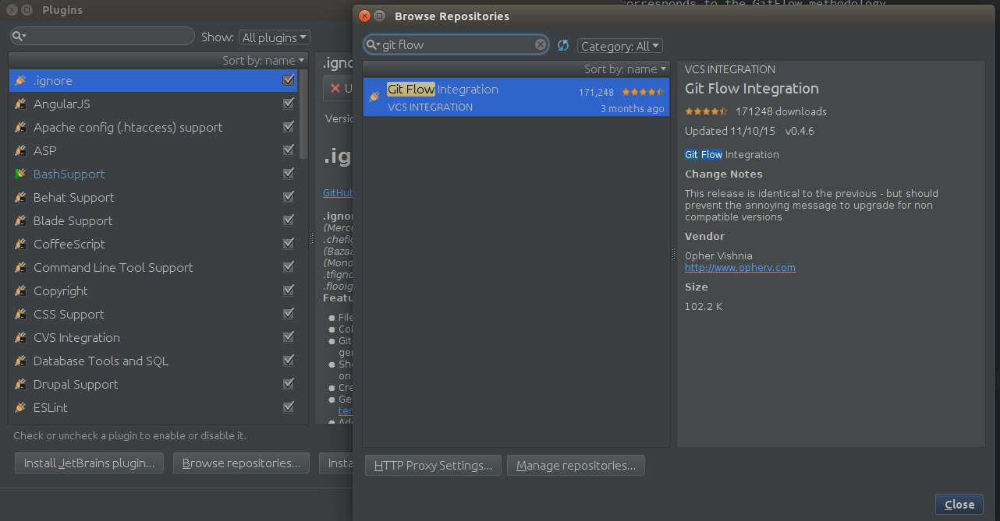

# Workflow

## Git Flow  

* [Git Flow Cheat Sheet](http://danielkummer.github.io/git-flow-cheatsheet/)
* [Git Flow Explained] (http://nvie.com/posts/a-successful-git-branching-model/)

**Please remember:** the `development` and `staging` branches still exist as of this writing (3/7/16).
The usage of the development branch is being phased out in favor of the `develop` branch since it corresponds to the GitFlow methodology.

### Recommended Git Flow Utilities

#### Commandline

#### SourceTree

#### PhpStorm (and other JetBrains IDE's)

* [Install](https://www.jetbrains.com/phpstorm/help/installing-updating-and-uninstalling-repository-plugins.html) the `Git Flow Integration` plugin
    * 

##### Adding a Feature Using PHPStorm

**Note:** If you have a branch named `development`, it will interfere with the Git Flow plugin since it uses `development/` as the prefix for feature branches.

* To add a feature click on the "Git Flow -> Start Feature" menu item in the bottom, right-hand corner
    * 
* Then create a new feature (default branch should be develop) by preceding it with a `/`:
    * 
* You should then see your new branch in the bottom menu bar's git integration
    * 

### Branch/Prefix Reference

Type                |   Branch or Prefix     
--------------------|-------------------------
Production          | master
Next Release        | develop
Feature Prefix      | feature/
Release Prefix      | release/
Hotfix Prefix       | hotfix/
Support Prefix      | prefix/
